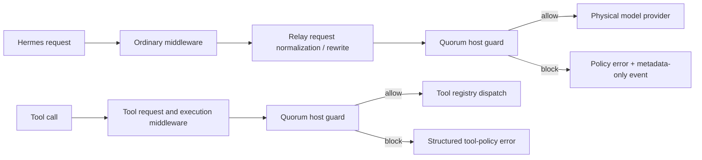

# Quorum Edition architecture

Quorum Edition is a downstream distribution of Hermes Agent. It deliberately
separates the security boundary from the plugin that presents it: removing or
disabling the Quorum dashboard must not disable enforcement.

## Dispatch path

The final check is in `agent/quorum_dispatch.py` and is called from the Relay
physical-provider seams and immediately before tool registry dispatch. Primary,
fallback, delegated, auxiliary, summary, Codex Responses, Anthropic Messages,
Bedrock, MoA, synchronous, asynchronous, and streaming model paths converge on
those seams.

## Policy contract

Quorum classifies inference destinations as device, loopback-local,
private-network, or cloud. Unknown providers fail conservative: without a
trusted endpoint descriptor they are cloud. Registered tools are either known
local capabilities or network-capable; unknown/plugin tools are treated as
network-capable.

- Private permits device and loopback inference and local registered tools.
- Balanced and Best quality may use off-device routes only after explicit
  cloud consent.
- Offline permits only device inference and blocks network-capable registered
  tools.
- Cost controlled is not selectable in the UI and fails closed until an atomic
  usage ledger exists.
- Recognized sensitive content is restricted to device/loopback inference and
  cannot be given to network-capable registered tools.

The default in `config.yaml` is Private with cloud consent false. Session
overrides are read from `quorum.session_policies`; the current desktop surface
only edits the default policy and consent flag.

## Failure behavior

The guard blocks governed dispatch when product identity, configuration, or
sensitive-content classification cannot be loaded. Its decision feed is a
bounded process-memory inspector buffer. Events contain policy, reach,
provider/model/tool names, outcome, reason, and sensitive category labels; they
do not retain prompts, message bodies, tool arguments, headers, or credentials.
The feed is explicitly not a durable audit ledger.

## Product and state identity

`product_identity.py` and `apps/desktop/product-identity.mjs` are the
source-authority contract. Quorum updates from `Quorum-Agent/hermes-agent` and
stores runtime state under `~/.quorum` (Unix) or
`%LOCALAPPDATA%\quorum` (native Windows). It never silently adopts `~/.hermes`.
Hermes remains credited as the upstream runtime.

## Coexistence and isolation

Quorum is built to run side by side with a stock Hermes install on the same
machine without collision. Isolation spans several dimensions:

- **State root.** Runtime state lives under `~/.quorum` (Unix) or
  `%LOCALAPPDATA%\quorum` (native Windows); Quorum never silently adopts
  `~/.hermes`. Auth tokens are not shared — Nous refresh tokens are single-use,
  so a shared `auth.json` would invalidate the other install's session.
- **CLI surface.** `quorum` is installed as an alias alongside the upstream
  `hermes` command; both resolve to the same entrypoint. `hermes` is kept so
  existing scripts and upstream documentation keep working.
- **Service identity.** The gateway registers as `quorum-gateway` (systemd) and
  `ai.quorum.gateway` (launchd), distinct from Hermes' `hermes-gateway` /
  `ai.hermes.gateway`. This keeps two installs from fighting over the same unit
  name, launchd label, or messaging bot token.
- **Telemetry.** Exported spans and gateway-health resource attributes identify
  as `quorum-gateway` so a shared observability backend does not merge the two
  installs.

### Ownership-verified unit migration

An install created before the service rename still has a `hermes-gateway` unit.
That name is ambiguous — it could be Quorum's own pre-rename unit (safe to
migrate to `quorum-gateway`) or a coexisting Hermes install's *current* unit
(must never be touched). `_unit_is_ours()` in `hermes_cli/gateway.py` resolves
the ambiguity before Quorum migrates or restarts any such unit. A unit is ours
when either:

- it carries the `# X-Quorum-Managed` marker Quorum writes into units it
  generates; or
- this install's resolved home or checkout path appears in the unit's
  `Environment=` / `ExecStart=` / `WorkingDirectory=` lines.

A side-by-side Hermes install references a different home and checkout and lacks
the marker, so it fails the check and is left alone. Detection, migration, and
the update-time fleet restart all fail closed — on any doubt, the foreign unit
is not touched. `quorum-gateway` units are ours by name and skip the check.

### Kept Hermes-compatible

To preserve upstream compatibility and keep merges reviewable, some identifiers
are intentionally *not* rebranded: the `hermes` CLI command, packaged
binary/process basenames (`Hermes.exe`, the `hermes-gateway` shim), `HERMES_*`
environment variables, the `hermes-gateway` toolset-bundle name, the
`HermesAgent` billing/User-Agent token, and Hermes attribution. Only user-facing
product identity and the service/telemetry identity are Quorum's.

## Built-in plugin and Companion

`plugins/quorum` is a bundled dashboard/command surface. It can display
status, save policy settings, and inspect projected process-local events. It
does not own enforcement.

`quorum-plugin.zip` is a reproducible Companion package for stock Hermes. A
stock host does not contain Quorum's mandatory physical-dispatch checks, so the
Companion reports visibility/compatibility only and never claims fail-closed
protection.

## Security boundary and limitations

The governed-dispatch boundary covers the model and registered-tool routes
integrated with it. It is not an OS sandbox or egress firewall. Terminal/code
payloads, trusted plugins, dependencies, and MCP server processes can open
their own sockets outside the governed API. Use container, host firewall, or
whole-process network policy where adversarial code or complete egress control
is in scope. See the repository `SECURITY.md` for the normative threat model.
