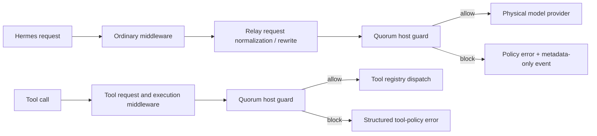

# Quorum Edition architecture

Quorum Edition is a downstream distribution of Hermes Agent. It deliberately
separates the security boundary from the plugin that presents it: removing or
disabling the Quorum dashboard must not disable enforcement.

## Dispatch path

The final check is in `agent/quorum_dispatch.py` and is called from the Relay
physical-provider seams and immediately before tool registry dispatch. Primary,
fallback, delegated, auxiliary, summary, Codex Responses, Anthropic Messages,
Bedrock, MoA, synchronous, asynchronous, and streaming model paths converge on
those seams.

## Policy contract

Quorum classifies inference destinations as device, loopback-local,
private-network, or cloud. Unknown providers fail conservative: without a
trusted endpoint descriptor they are cloud. Registered tools are either known
local capabilities or network-capable; unknown/plugin tools are treated as
network-capable.

- Private permits device and loopback inference and local registered tools.
- Balanced and Best quality may use off-device routes only after explicit
  cloud consent.
- Offline permits only device inference and blocks network-capable registered
  tools.
- Cost controlled is not selectable in the UI and fails closed until an atomic
  usage ledger exists.
- Recognized sensitive content is restricted to device/loopback inference and
  cannot be given to network-capable registered tools.

The default in `config.yaml` is Private with cloud consent false. Session
overrides are read from `quorum.session_policies`; the current desktop surface
only edits the default policy and consent flag.

## Failure behavior

The guard blocks governed dispatch when product identity, configuration, or
sensitive-content classification cannot be loaded. Its decision feed is a
bounded process-memory inspector buffer. Events contain policy, reach,
provider/model/tool names, outcome, reason, and sensitive category labels; they
do not retain prompts, message bodies, tool arguments, headers, or credentials.
The feed is explicitly not a durable audit ledger.

## Product and state identity

`product_identity.py` and `apps/desktop/product-identity.mjs` are the
source-authority contract. Quorum updates from `Quorum-Agent/hermes-agent` and
stores runtime state under `~/.quorum` (Unix) or
`%LOCALAPPDATA%\quorum` (native Windows). It never silently adopts `~/.hermes`.
Hermes remains credited as the upstream runtime.

## Built-in plugin and Companion

`plugins/quorum` is a bundled dashboard/command surface. It can display
status, save policy settings, and inspect projected process-local events. It
does not own enforcement.

`quorum-plugin.zip` is a reproducible Companion package for stock Hermes. A
stock host does not contain Quorum's mandatory physical-dispatch checks, so the
Companion reports visibility/compatibility only and never claims fail-closed
protection.

## Security boundary and limitations

The governed-dispatch boundary covers the model and registered-tool routes
integrated with it. It is not an OS sandbox or egress firewall. Terminal/code
payloads, trusted plugins, dependencies, and MCP server processes can open
their own sockets outside the governed API. Use container, host firewall, or
whole-process network policy where adversarial code or complete egress control
is in scope. See the repository `SECURITY.md` for the normative threat model.
